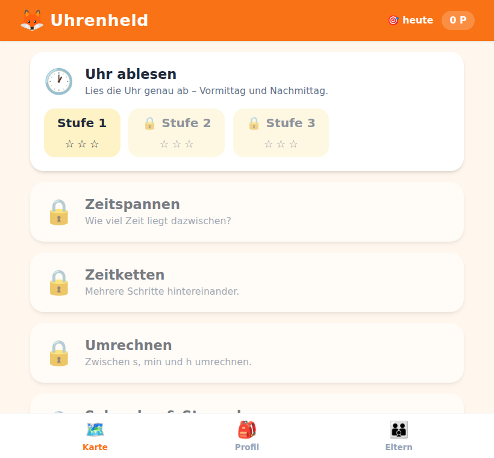
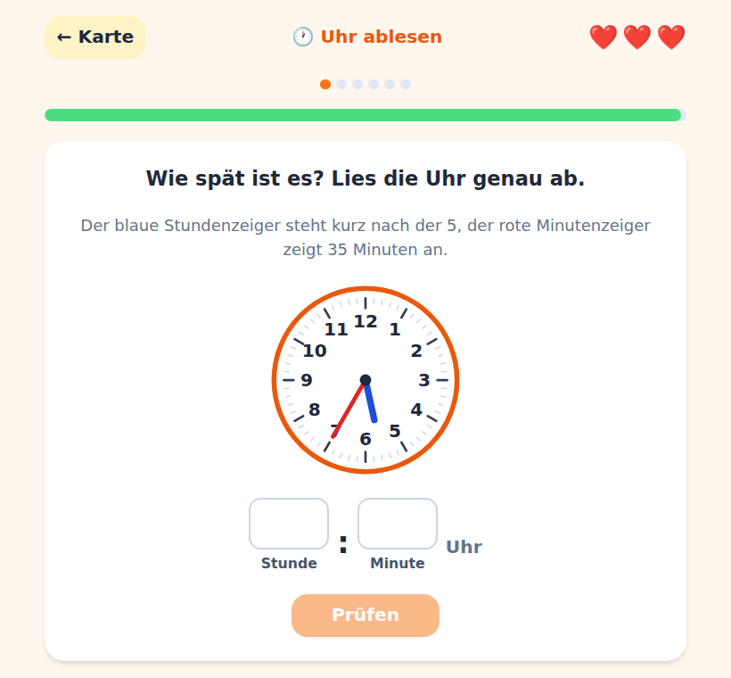

# Uhrenheld 🕐

[](https://github.com/bernhardmayr/uhrenheld/actions/workflows/ci.yml)
[](https://github.com/bernhardmayr/uhrenheld/actions/workflows/deploy.yml)

Eine spielerische Lern-Web-App, die Grundschulkindern (3. Klasse, 8–9 Jahre) das
**Uhrlesen** und das **Rechnen mit Zeitpunkten und Zeitspannen** beibringt – mit
Punkten, Serien, Herzen, Sternen und Abzeichen statt Arbeitsblatt am Bildschirm.

**Live-Demo:** https://bernhardmayr.github.io/Uhrenheld/

<p>
  
  
</p>

## Features

- 🕐 **Uhr ablesen** minutengenau, mit Vor-/Nachmittags-Doppelantwort
- ⏳ **Zeitspannen** (Dauer / Start / Ende), auch über die volle Stunde
- 🔗 **Zeitketten** mit Gesamtdauer und fehlender Zwischenzeit
- 🔄 **Umrechnen** zwischen s, min und h (inkl. Brüchen wie ½ h, 2¾ h)
- ⏱️ **Sekundenzeiger & Stoppuhr** inkl. Übergang 01:00 → 00:59
- 🤔 **Passende Einheit** wählen (s/min/h) als schnelles Multiple-Choice
- 🚆 **Fahrplan** mit Abfahrt, Fahrzeit, Ankunft
- 📖 **Sachaufgaben** mit kindgerechten Kontexten
- 🎮 Punkte, Serien-Multiplikator, Herzen, 1–3 Sterne, Abzeichen-Album,
  freischaltbare Avatare & Zifferblätter, Levelkarte, Tages-Streak
- 👪 Eltern-/Lehreransicht mit lokaler Statistik und Fehlertyp-Auswertung
- ♿ Tastaturbedienbar, Screenreader-Labels, hohe Kontraste, Touch-Ziele ≥ 48 px
- 📴 PWA: installierbar und offline nutzbar, **kein Backend, kein Tracking**

## Abgedeckte Lernziele

Uhr minutengenau ablesen · Vor-/Nachmittag (12/24 h) · Zeitspannen berechnen ·
Zeitpunkte vor-/zurückrechnen über die volle Stunde und Mitternacht · Einheiten
s/min/h umrechnen · Brüche von Stunden · Fahrpläne lesen · Sachaufgaben lösen.
Details in [`docs/SPEC.md`](docs/SPEC.md).

## Tech-Stack

Vite · React 18 · TypeScript (strict) · Tailwind CSS · Zustand · Vitest +
React Testing Library · vite-plugin-pwa. Details in
[`docs/adr/0001-tech-stack.md`](docs/adr/0001-tech-stack.md).

## Lokale Installation

```bash
npm install
npm run dev      # http://localhost:5173/Uhrenheld/
npm run test     # Tests
npm run build    # Produktions-Build nach dist/
```

Node ≥ 20 (siehe `.nvmrc`).

## Dokumentation

- 📖 **[SPEC.md](docs/SPEC.md)** – Fachliche Spezifikation & Lernziele pro Block
- 🎨 **[DESIGN.md](docs/DESIGN.md)** – Farbpalette, Komponenten, Barrierefreiheit
- 🎮 **[GAMEPLAY.md](docs/GAMEPLAY.md)** – Punktesystem, Abzeichen, Progression
- ✅ **[TESTING.md](docs/TESTING.md)** – Unit-Tests (100%), E2E-Tests, Debugging
- 🚀 **[DEPLOYMENT.md](docs/DEPLOYMENT.md)** – GitHub Pages-Workflow, CI/CD, Rollback
- 📅 **[ROADMAP.md](docs/ROADMAP.md)** – Meilensteine M0–M5, Status
- 🔍 **[PWA-AUDIT.md](docs/PWA-AUDIT.md)** – Offline-Funktionalität, Manifest-Audit

## Projektstruktur

```
src/
  components/  Wiederverwendbare UI (AnalogClock, Stopwatch, Timeline, …)
  features/    Screens (round, results, levelmap, profile, parent)
  lib/         Zeitlogik, Aufgabengeneratoren, Punkte, Fortschritt (getestet)
  hooks/       useRound, useSound
  data/        Blockkatalog, Cosmetics
  store/       Zustand-Store (localStorage)
docs/          SPEC, DESIGN, GAMEPLAY, ROADMAP, Vorlagen-Analyse, ADR
```

## Einmalige Repo-Einstellungen

- **Pages-Source = GitHub Actions** (Settings → Pages).
- **Branch Protection** auf `main` (PR + grüne CI erforderlich).

## Mitmachen

Siehe [`CONTRIBUTING.md`](CONTRIBUTING.md). Ein Feature = ein Branch = ein PR,
Conventional Commits, CI muss grün sein.

## Lizenz

[MIT](LICENSE). Alle Inhalte sind selbst formuliert; es werden keine Texte oder
Grafiken aus dem Arbeitsheft übernommen.
